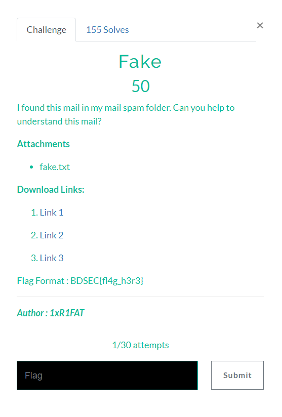

# Fake

## Instruction

## Fake.txt


```
Dear E-Commerce professional ; This letter was specially 
selected to be sent to you . This is a one time mailing 
there is no need to request removal if you won't want 
any more . This mail is being sent in compliance with 
Senate bill 1624 , Title 1 , Section 302 ! This is 
not a get rich scheme ! Why work for somebody else 
when you can become rich as few as 60 WEEKS .
....
```
You can find the full text on the following link : [github.com/Beel0w/BDSecCTF/fake.txt](https://github.com/Beel0w/BDSecCTF/blob/4d2e025384b5f170ebc6948f2d8c53b8fe473111/Cryptography/Fake/fake.txt)

## Solving

The message is hidden in spam. This is the Spammimic.  

We can find the message with this link : [spammimic.com/decode.cgi](https://www.spammimic.com/decode.shtml)  
```
We get: Hello Mr.Alex   I won't 100000 M USD dolor. Can  you want that, you need this key   BDSEC{do3sn't_b3li3ve_1n_unkn0wn_mail}   
```
Flag Is : **_BDSEC{do3sn't_b3li3ve_1n_unkn0wn_mail}_**

