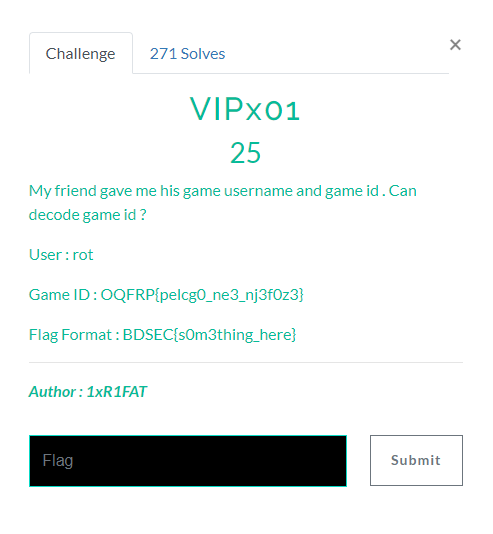

# VIPx01

## Instruction

# Solving

**Game ID : OQFRP{pelcg0_ne3_nj3f0z3}**

With Dcode we can find the encryption type : [dcode.fr/cipher-identifier](https://www.dcode.fr/cipher-identifier)
It's a subsitution encryption : Affine Cipher

We can brute force Decryption to find the falue of A COEFFICIENT and B COEFFICIENT.  

With A = 1 and B = 13 : BDSEC{crypt0_ar3_aw3s0m3}  

Flag Is : **_BDSEC{crypt0_ar3_aw3s0m3}_**
