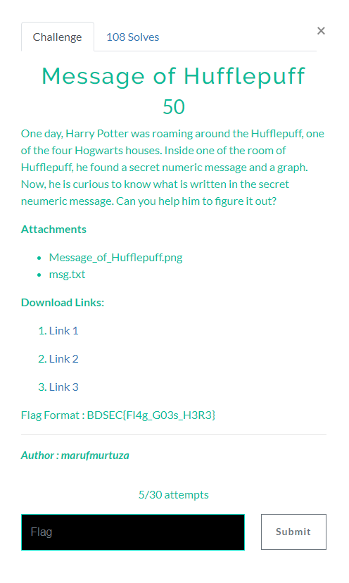

# Message of Hufflepuff

## Instruction


## Msg.txt and Message_of-Hufflepuff.png
```
001011110011010111001001110001001000100010000010001011110111001011110100001011000100101101110110101100101001010011101100111011111001000111110111111100000
```

## Solving
From msg.txt:
- If there is a 0 you have to go left
- If there is a 1 you have to go right
- When we get to the bottom, we note the value and return to the top to continue the sequence.

- Exemple :
  - 00101 = left + left + right + left + right = B  
  - 111 = right + right + right = D  
  - 00110 = left + left + right + right + left = S  
  - 1011 = right + left + right + right = E
  - 1001 = right + left + left + right = C

After decoding everything we get: BDSEC{Huffm@n_Enc0d1ng_go7_D3COD3D}

Flag Is : **_BDSEC{Huffm@n_Enc0d1ng_go7_D3COD3D}_**
