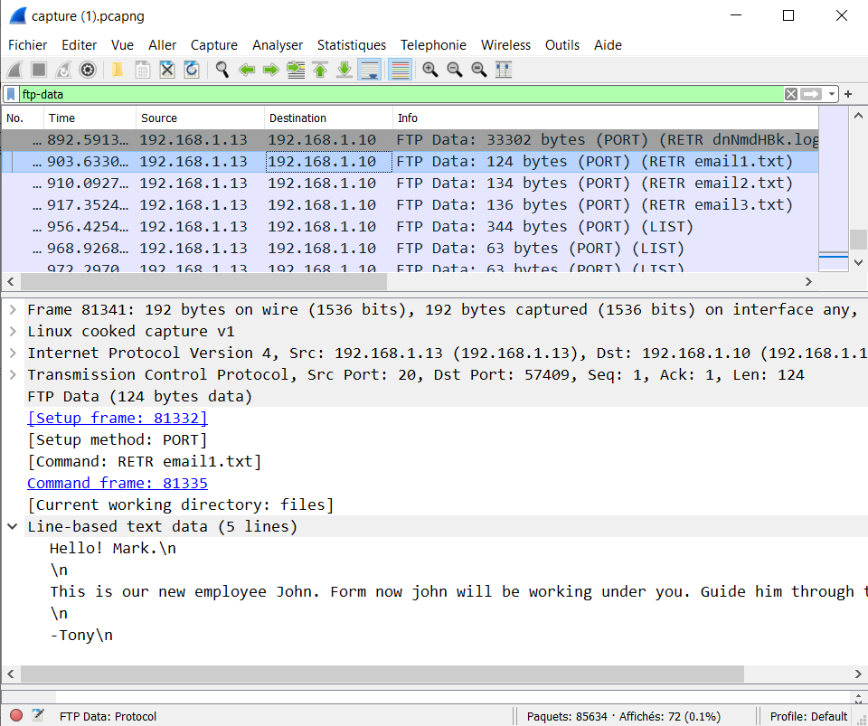

# Networking

## Victim & Attacker

### Context
> NSTechvally is an multinational hosting & cloud service providing company. Recently we have detected some unusal activity to the server. An attacker got access to our server. And we recently found out that the developer did some mistakes developing our website. We have captured the network traffic. Help us to find out how the attacker compromised our server.  
> 
> **N.B: This is the challenge file for all the networking challenges.**  
> 
> Attachments : 
>  - [capture.pcapng](capture.pcapng)
>  
> What is the server ip & the attacker ip?  
> Flag Format: BDSEC{0.0.0.0_127.0.0.1}
> 
> **Author : TareqAhamed**

### Resolving

On Wireshark, if we check all conversation : 

            

We can see a conversation with 2 ip : 192.168.1.13 and 192.168.1.10 and an important number of bytes.
The main Address A for Conversations Module is 192.168.1.10. It's the attacker. 192.168.1.13 is the server.

The flag Is : `BDSEC{192.168.1.13_192.168.1.10} `

## Which FTP?

### Context
>What ftp & version the server is using?
>
>Flag Format : BDSEC{ftp_0.0.0}
>
>**Author : marufmurtuza**

### Resolving

By adding a filter _ftp_ in Wireshark. 

            

We can see vsFTPd 3.0.3 in the information Section

The flag Is : `BDSEC{vsFTPD_3.0.3} `

## FTP Creads

### Context
>What is the ftp username & password?
>
>Flag Format : BDSEC{username_password}
>
>**Author : TareqAhamed**

### Resolving

            

USER = ftpadmin
PASS = ftpadmin

The flag Is : `BDSEC{ftpadmin_ftpadmin} `

## Uploaded File

            

## Log File

## Project Incharge

            

## Loooong Loooong

## Administrator

## Shell

## Secret Key

## Database Admin

## Hostname

## CodeName

## Server Info

## Service Exploit

## Exploit Exploit

## Vulnérable Service

## msg.txt

## Attacker

## Server User's

## Resolving

We can use dcode to solve this challenge : [dcode/chiffre-rsa](https://www.dcode.fr/chiffre-rsa)

We just have to enter the value of N, E and C and click on "Calculate/Uncipher"

Flag Is : **_BDSEC{r54_i5_fUn_r16h7?}_**
