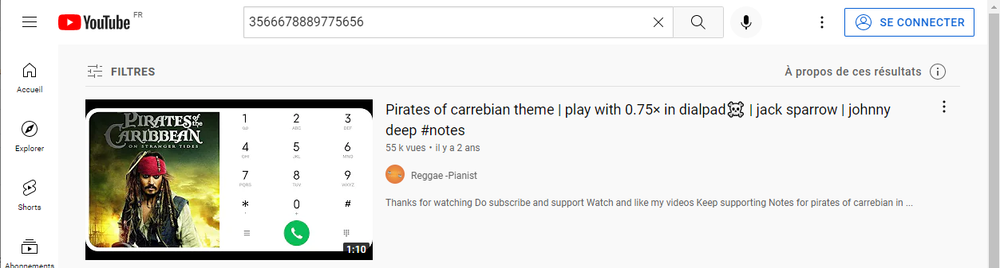

# Find The Masterpiece

## Context

>My friend gave me the following stream of numbers and told me to figure out something of it. He gave me a hint that, the thing hidden behind the numbers is very known to me and piano keys might help me to solve the challenge. He also claimed that it is a master piece. So, he also asked for the creation date of that master piece. Please help me to solve that mistery!
>
>_3566678889775656-356667888977565-35666899900906-687798-3566678889775656-3566678889775656_
>
>**Flag Format: BDSEC{name_of_the_master_piece,year}**
>
>Special note: All the letter of the flag are lower case and there will be a special character in the flag unlike the other challenge flags.
>
>**Author : marufmurtuza**

## Resolving

To find the masterpiece, I decided to launch Youtube and to search 3566678889775656.   

On the first result, we can see [Pirates of carrebian theme | play with 0.75× in dialpad☠️ | jack sparrow | johnny deep #notes](https://www.youtube.com/watch?v=wQAt_0rA0wk)  

The name of this Pirates of carrebian music is : [He's a Pirate](https://en.wikipedia.org/wiki/He%27s_a_Pirate) and was composed by Klaus Badelt and Hans Zimmer in 2003.

The Flag is : `BDSEC{he's_a_pirate,2003}`

