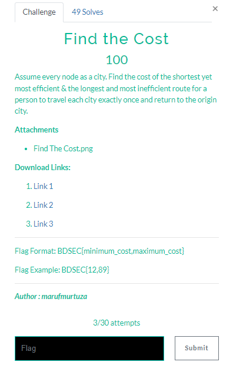
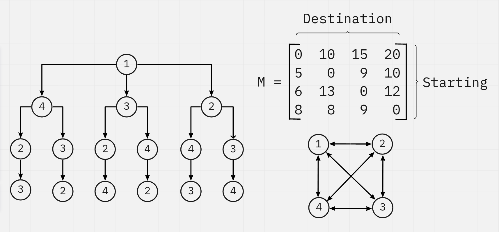

# Find the Cost

## Instruction


## Find The Cost.png



## Resolving

We can create this script with python :

``` ruby
def blocks(x, n=16):
    return list(zip(*[iter(x)] * n))

M = blocks([0, 10, 15, 20, 5, 0, 9, 10, 6, 13, 0, 12, 8, 8, 9, 0], 4)

from itertools import permutations

costs = set()
for p in permutations(range(4)):
    p = p + (p[0],)
    c = 0
    for x, y in zip(p, p[1:]):
        c += M[x][y]
    costs.add(c)
print(costs)
```
Result = {35, 39, 40, 43, 46, 47}

Flag Is : **_BDSEC{35,47}_**
